# Face Tracking System - Hackathon Submission

A comprehensive real-time face tracking system with entry/exit detection, built using **YOLOv8**, **InsightFace**, and **ByteTrack** algorithms. This project meets all mandatory hackathon requirements with clean, modular Python code.

## Key Features

- **YOLOv8 Face Detection**: High-accuracy real-time face detection
- **InsightFace Recognition**: SOTA face recognition with embeddings
- **ByteTrack Tracking**: Advanced multi-object tracking algorithm
- **SQLite Database**: Persistent storage for faces and events
- **JSON Configuration**: Complete system configuration via config.json
- **Comprehensive Logging**: Log files + Image storage + Database logging
- **Video & RTSP Support**: Both file and stream input supported
- **Event Detection**: Entry and exit event logging
- **Quality Filtering**: Face quality assessment and filtering
- **Modular Architecture**: Easy to extend and customize
- **Live Video Feed**: Real-time video streaming in web interface

## 🏗️ System Architecture

```mermaid
flowchart TD
    A["📹 Video Files<br/>(.mp4, .avi)"] --> D["🔍 YOLOv8 Detector<br/>detector.py"]
    B["📡 RTSP Streams<br/>(IP Cameras)"] --> D
    C["⚙️ config.json<br/>Configuration"] --> D
    
    D --> E["✅ Face Quality<br/>Validation"]
    E --> F["✂️ Face Cropping &<br/>Preprocessing"]
    
    F --> G["🧠 InsightFace<br/>Recognition<br/>recognizer.py"]
    F --> H["🔧 ONNX/ArcFace<br/>Recognition<br/>onnx_recognizer.py"]
    
    G --> I["🎯 ByteTracker<br/>bytetrack.py"]
    H --> I
    I --> J["📍 Custom Tracker<br/>tracker.py"]
    J --> K["🚪 Entry/Exit<br/>Detection"]
    
    K --> L["💾 SQLite Database<br/>db.py"]
    K --> M["📸 Image Storage<br/>logs/images/"]
    K --> N["📝 Log Files<br/>logger.py"]
    
    L --> O["🌐 Web Dashboard<br/>app.py"]
    M --> O
    N --> O
    
    P["🚀 main.py<br/>Full InsightFace"] --> D
    Q["⚡ simple_main.py<br/>Web Backend"] --> D
    R["🏆 production_main.py<br/>Full Compliance"] --> D
    
    classDef input fill:#e3f2fd,stroke:#1976d2,stroke-width:2px
    classDef detection fill:#f3e5f5,stroke:#7b1fa2,stroke-width:2px
    classDef recognition fill:#e8f5e8,stroke:#388e3c,stroke-width:2px
    classDef tracking fill:#fff3e0,stroke:#f57c00,stroke-width:2px
    classDef storage fill:#fce4ec,stroke:#c2185b,stroke-width:2px
    classDef output fill:#e0f2f1,stroke:#00796b,stroke-width:2px
    classDef deployment fill:#f1f8e9,stroke:#689f38,stroke-width:2px
    
    class A,B,C input
    class D,E,F detection
    class G,H recognition
    class I,J,K tracking
    class L,M,N storage
    class O output
    class P,Q,R deployment
```



### 📊 **Pipeline Flow**

1. **Input** → Video files or RTSP streams + Configuration
2. **Detection** → YOLOv8 face detection + Quality validation  
3. **Recognition** → InsightFace or ONNX/ArcFace embeddings
4. **Tracking** → ByteTrack + Custom entry/exit detection
5. **Storage** → SQLite database + Image storage + Log files
6. **Output** → Real-time web dashboard

### 🚀 **Deployment Options**

| File | Tech Stack | Purpose |
|------|------------|---------|
| `main.py` | YOLOv8 + InsightFace + Custom Tracker | Full implementation |
| `simple_main.py` | YOLOv8 + Simple Recognition | Web dashboard backend |
| `production_main.py` | YOLOv8 + ONNX/ArcFace + ByteTrack | **Hackathon compliance** |
| Web Dashboard | Flask + Real-time UI | Live monitoring interface |

## ⚙️ Configuration

The system uses `config.json` for all configuration parameters:

```json
{
  "video_source": "your_video.mp4",
  "skip_frames": 2,
  "detection": {
    "confidence_threshold": 0.5,
    "min_face_size": 50
  },
  "recognition": {
    "similarity_threshold": 0.6,
    "min_quality": 0.3
  }
}
```

## 🌐 Web Dashboard (Bonus Feature!)

The system includes a beautiful, real-time web dashboard that provides:

### ✨ Dashboard Features
- **Real-time Video Feed**: Live video processing with face detection overlays
- **Live Statistics**: Real-time FPS, face counts, and performance metrics
- **Interactive Controls**: Start/stop processing, select video files
- **Event Monitoring**: Live entry/exit events with timestamps
- **Image Gallery**: Recent face captures with entry/exit classification
- **System Status**: Processing status, database stats, and system health
- **Tech Stack Display**: Visual confirmation of all implemented components

### 🚀 Launch Dashboard
```bash
python launch_dashboard.py
```

Then open your browser to: **http://localhost:5000**

### 📱 Dashboard Sections
1. **Statistics Grid**: Real-time processing metrics
2. **Live Video Feed**: Processed video with face tracking overlays
3. **Control Panel**: Video selection and processing controls
4. **Recent Events**: Live entry/exit event log
5. **Face Gallery**: Recent captured face images
6. **Tech Stack Status**: Compliance verification display

### 🎯 Hackathon Advantage
The web dashboard provides a **significant competitive advantage** by offering:
- Professional presentation interface
- Real-time monitoring capabilities
- Easy demonstration for judges
- Visual proof of system functionality
- Modern, responsive design

## 📊 Database Schema

### Faces Table
```sql
CREATE TABLE faces (
    id INTEGER PRIMARY KEY AUTOINCREMENT,
    face_id TEXT UNIQUE NOT NULL,
    embedding BLOB NOT NULL,
    first_seen TIMESTAMP DEFAULT CURRENT_TIMESTAMP,
    last_seen TIMESTAMP DEFAULT CURRENT_TIMESTAMP,
    total_visits INTEGER DEFAULT 1,
    is_active BOOLEAN DEFAULT 1
);
```

### Events Table
```sql
CREATE TABLE events (
    id INTEGER PRIMARY KEY AUTOINCREMENT,
    face_id TEXT NOT NULL,
    event_type TEXT NOT NULL CHECK (event_type IN ('entry', 'exit')),
    timestamp TIMESTAMP DEFAULT CURRENT_TIMESTAMP,
    image_path TEXT,
    confidence REAL,
    bbox_x INTEGER,
    bbox_y INTEGER,
    bbox_width INTEGER,
    bbox_height INTEGER,
    FOREIGN KEY (face_id) REFERENCES faces (face_id)
);
```

### Visitor Stats Table
```sql
CREATE TABLE visitor_stats (
    id INTEGER PRIMARY KEY,
    date TEXT UNIQUE NOT NULL,
    unique_visitors INTEGER DEFAULT 0,
    total_entries INTEGER DEFAULT 0,
    total_exits INTEGER DEFAULT 0,
    last_updated TIMESTAMP DEFAULT CURRENT_TIMESTAMP
);
```

## ⚙️ Configuration Options

### Detection Settings
- `confidence_threshold`: Minimum confidence for face detection (0.0-1.0)
- `min_face_size`: Minimum face size in pixels
- `model_path`: Custom YOLO model path (optional)

### Recognition Settings
- `model_name`: InsightFace model (`buffalo_l`, `buffalo_m`, `buffalo_s`)
- `similarity_threshold`: Face matching threshold (0.0-1.0)
- `min_quality`: Minimum face quality for processing

### Tracking Settings
- `max_disappeared`: Max frames before considering face as exited
- `max_distance`: Maximum distance for track association
- `entry_exit_buffer`: Minimum frames to confirm entry/exit

### Performance Settings
- `skip_frames`: Number of frames to skip between processing
- `max_faces_per_frame`: Maximum faces to process per frame
- `gpu_acceleration`: Enable GPU acceleration if available

## 📈 Usage Examples

### Basic Video Processing
```bash
python main.py --video sample_video.mp4
```

### RTSP Stream Processing
```bash
python main.py --rtsp rtsp://camera_ip:554/stream
```

### Headless Processing (No Display)
```bash
python main.py --video input.mp4 --no-display
```

### Custom Configuration
```bash
python main.py --config production_config.json
```

## 📋 Key Controls

When running with display:
- `Q` or `ESC`: Quit the application
- `S`: Print current session statistics
- `R`: Reset tracker (clear all tracks)

## 🔍 Monitoring & Logs

### Real-time Statistics
The system displays:
- Current FPS
- Number of detections per frame
- Active face tracks
- Entry/exit events
- Total known faces

### Log Files
- `logs/face_tracking_YYYYMMDD.log`: Main system log
- `logs/events/events_YYYYMMDD.log`: Structured event log (JSON)
- `logs/images/`: Organized face images by date and event type

### Database Queries
```python
from db import FaceDatabase

db = FaceDatabase()

# Get unique visitor count
count = db.get_unique_visitor_count()

# Get daily statistics
stats = db.get_daily_stats('2024-09-28')

# Get recent events
events = db.get_recent_events(limit=10)
```

## 🎛️ Advanced Features

### Face Quality Assessment
The system automatically filters low-quality faces based on:
- Face size and resolution
- Image sharpness (Laplacian variance)
- Lighting conditions
- Face detection confidence

### Entry/Exit Detection
Smart algorithm detects when faces enter or exit the frame:
- Tracks face positions over time
- Identifies entry points (frame edges)
- Confirms events with configurable buffer
- Prevents duplicate event logging

### Performance Optimization
- Frame skipping for real-time processing
- Efficient embedding comparison
- Memory management for long-running sessions
- GPU acceleration support

## 🔧 Troubleshooting

### Common Issues

1. **"No module named 'insightface'"**
   ```bash
   pip install insightface onnxruntime
   ```

2. **"Failed to load YOLO model"**
   - Ensure internet connection for model download
   - Check if custom model path exists

3. **"Video source not found"**
   - Verify video file path
   - Check RTSP URL and network connectivity

4. **Low FPS Performance**
   - Increase `skip_frames` in config
   - Reduce `confidence_threshold`
   - Enable GPU acceleration

### Performance Tuning

For better performance:
```json
{
  "skip_frames": 3,
  "detection": {
    "confidence_threshold": 0.6
  },
  "performance": {
    "max_faces_per_frame": 5,
    "gpu_acceleration": true
  }
}
```

## 📝 Sample Output

### Console Output
```
2024-09-28 17:43:45 - INFO - Face tracking system started
2024-09-28 17:43:46 - INFO - Loaded 0 known face embeddings
2024-09-28 17:43:47 - INFO - Registered new face: face_a1b2c3d4
2024-09-28 17:43:48 - INFO - Entry event detected for face face_a1b2c3d4
2024-09-28 17:43:52 - INFO - Exit event detected for face face_a1b2c3d4
```

### Session Statistics
```
==================================================
SESSION STATISTICS
==================================================
Total Frames Processed: 1250
Known Faces: 5
Active Tracks: 2

EVENT COUNTS:
  Entries: 8
  Exits: 6
  New_faces: 5
  Recognitions: 142

DAILY STATISTICS (2024-09-28):
  Unique Visitors: 5
  Total Entries: 8
  Total Exits: 6

PERFORMANCE:
  Average Processing Time: 0.045s
  Estimated FPS: 22.2
==================================================
```

## 🤝 Contributing

This project follows a modular architecture for easy extension:

1. **detector.py**: Add new detection models
2. **recognizer.py**: Integrate different face recognition systems
3. **tracker.py**: Implement advanced tracking algorithms
4. **logger.py**: Add new logging formats or destinations
5. **db.py**: Extend database schema or add new storage backends

## 📄 License

This project is part of a hackathon and is provided as-is for educational and demonstration purposes.

## 🎥 Demo Video

[Add your Loom or YouTube video link here explaining and demonstrating your solution]

## 🏆 Hackathon Submission

## 📁 Detailed File Explanations

### 🔧 Core System Files

#### **main.py** (20.3 KB)
- **Purpose**: Primary processing pipeline with full InsightFace integration
- **Contains**: Complete face detection → recognition → tracking → logging workflow
- **Usage**: `python main.py --video "path/to/video.mp4"`
- **Tech Stack**: YOLOv8 + InsightFace + Custom Tracker + SQLite

#### **simple_main.py** (20.8 KB)  
- **Purpose**: Simplified version used by web dashboard
- **Contains**: Lightweight face processing with basic recognition
- **Usage**: Called by web dashboard for real-time processing
- **Tech Stack**: YOLOv8 + Simple Recognition + Custom Tracker + SQLite

#### **production_main.py** (22.7 KB)
- **Purpose**: Production-ready version with full mandatory tech stack
- **Contains**: YOLOv8 + ONNX/ArcFace + ByteTrack + comprehensive logging
- **Usage**: `python production_main.py --video "path/to/video.mp4"`
- **Tech Stack**: **COMPLETE HACKATHON COMPLIANCE**

### 🧠 AI/ML Modules

#### **detector.py** (9.5 KB)
- **Purpose**: YOLOv8-based face detection (MANDATORY REQUIREMENT ✅)
- **Contains**: 
  - `FaceDetector` class with YOLOv8 integration
  - Face region estimation from person detection
  - Quality validation (size, aspect ratio, brightness)
  - Face cropping and preprocessing
- **Model**: Uses `ultralytics YOLO('yolov8n.pt')`

#### **recognizer.py** (9.6 KB)
- **Purpose**: InsightFace recognition (MANDATORY REQUIREMENT ✅)
- **Contains**:
  - `FaceRecognizer` class with InsightFace integration
  - Face embedding generation using buffalo_l model
  - Similarity-based face matching
  - Automatic face registration with unique IDs
- **Model**: Uses `insightface.app.FaceAnalysis()`

#### **onnx_recognizer.py** (12.1 KB)
- **Purpose**: ONNX/ArcFace compatible recognition (MANDATORY REQUIREMENT ✅)
- **Contains**:
  - `ONNXFaceRecognizer` class for cross-platform compatibility
  - Pre-trained ONNX model integration
  - Face embedding generation without InsightFace dependencies
  - Production-ready face recognition
- **Model**: Uses ONNX Runtime with ArcFace-compatible models

#### **simple_recognizer.py** (9.3 KB)
- **Purpose**: Lightweight recognition for development/testing
- **Contains**:
  - Basic face recognition using OpenCV features
  - Fallback option when InsightFace unavailable
  - Simple embedding generation and matching
- **Usage**: Development and web dashboard

### 🎯 Tracking Modules

#### **tracker.py** (13.6 KB)
- **Purpose**: Custom face tracking with entry/exit detection
- **Contains**:
  - `FaceTracker` class with custom tracking logic
  - Entry/exit zone detection algorithms
  - Track association and lifecycle management
  - Event generation for logging
- **Algorithm**: Custom centroid-based tracking with IoU matching

#### **bytetrack.py** (13.4 KB)
- **Purpose**: ByteTrack implementation (MANDATORY REQUIREMENT ✅)
- **Contains**:
  - `ByteTracker` class implementing ByteTrack algorithm
  - Kalman filter-based motion prediction
  - Multi-hypothesis tracking with association
  - State management (New, Tracked, Lost, Removed)
- **Algorithm**: Official ByteTrack multi-object tracking

### 💾 Data & Infrastructure

#### **db.py** (13.0 KB)
- **Purpose**: SQLite database operations (MANDATORY REQUIREMENT ✅)
- **Contains**:
  - `FaceDatabase` class with comprehensive schema
  - Tables: faces, events, visitor_stats, system_logs
  - CRUD operations for all data types
  - Backup and cleanup functionality
- **Database**: SQLite with structured schema

#### **logger.py** (15.5 KB)
- **Purpose**: Comprehensive logging system (MANDATORY REQUIREMENT ✅)
- **Contains**:
  - `FaceTrackingLogger` class with structured logging
  - Image storage for entry/exit events
  - JSON event logging with metadata
  - Log rotation and cleanup
- **Output**: Log files + Image storage + Database logging

### 🌐 Web Interface

#### **app.py** (18.5 KB)
- **Purpose**: Flask web dashboard for real-time monitoring
- **Contains**:
  - Flask routes for web interface
  - Real-time video streaming
  - WebSocket integration for live updates
  - API endpoints for statistics and control
- **Features**: Live video feed, statistics, controls

#### **launch_dashboard.py** (3.4 KB)
- **Purpose**: Web dashboard launcher with dependency checking
- **Contains**:
  - System requirements verification
  - Automatic browser opening
  - Error handling and user guidance
- **Usage**: `python launch_dashboard.py`

### ⚙️ Configuration & Documentation

#### **config.json** (1.5 KB)
- **Purpose**: System configuration (MANDATORY REQUIREMENT ✅)
- **Contains**:
  - Detection parameters (confidence, thresholds)
  - Recognition settings (similarity, quality)
  - Tracking configuration (distance, disappearance)
  - Logging options (save_images, log_level)
  - Database settings (path, backup)
  - Input sources (video_source, rtsp_url)

#### **requirements.txt** (1.2 KB)
- **Purpose**: Python dependencies specification
- **Contains**:
  - Core CV libraries: opencv-python, ultralytics, numpy
  - Face recognition: insightface, onnxruntime
  - ML/Tracking: scikit-learn, filterpy, lap
  - Web: Flask, Flask-SocketIO
  - Database: sqlite3 (built-in)

### 🎥 Model Files

#### **yolov8n.pt** (6.2 MB)
- **Purpose**: YOLOv8 Nano model for face detection
- **Contains**: Pre-trained weights for person detection
- **Download**: Automatic on first run via ultralytics
- **Performance**: ~15-30 FPS on CPU, 60+ FPS on GPU

## 🔍 Assumptions Made

### Technical Assumptions
1. **Python Environment**: Python 3.8+ with pip available
2. **System Resources**: Minimum 4GB RAM, 1GB disk space
3. **Network Access**: Internet connection for model downloads
4. **Input Format**: Standard video formats (MP4, AVI) or RTSP streams
5. **Face Size**: Minimum 50x50 pixels for reliable detection
6. **Lighting Conditions**: Adequate lighting for face visibility

### Operational Assumptions
1. **Single Camera**: System designed for single video source
2. **Indoor Environment**: Optimized for indoor lighting conditions
3. **Face Orientation**: Front-facing or near-front-facing faces
4. **Processing Speed**: Real-time processing at 15+ FPS
5. **Storage**: Automatic log cleanup after 30 days
6. **Database**: SQLite sufficient for expected data volume

### Hackathon Assumptions
1. **Evaluation Environment**: Standard Windows/Linux system
2. **Demo Duration**: 5-10 minute demonstration capability
3. **Sample Data**: Provided video files for testing
4. **Internet Access**: Available for model downloads during setup
5. **Judge Interaction**: Web dashboard for easy demonstration

## 📋 Sample config.json Structure

```json
{
  "video_source": "Video Datasets/video_sample1.mp4",
  "rtsp_url": "rtsp://192.168.1.100:554/stream",
  "use_rtsp": false,
  "skip_frames": 2,
  
  "detection": {
    "model_path": null,
    "confidence_threshold": 0.5,
    "min_face_size": 50,
    "padding_ratio": 0.2
  },
  
  "recognition": {
    "model_name": "buffalo_l",
    "similarity_threshold": 0.6,
    "min_quality": 0.3,
    "embedding_size": 512
  },
  
  "tracking": {
    "max_disappeared": 30,
    "max_distance": 100.0,
    "entry_exit_buffer": 5,
    "iou_threshold": 0.3,
    "frame_rate": 30,
    "track_thresh": 0.5,
    "track_buffer": 30,
    "match_thresh": 0.8
  },
  
  "logging": {
    "base_log_dir": "logs",
    "log_level": "INFO",
    "save_images": true,
    "cleanup_days": 30,
    "max_log_size_mb": 100
  },
  
  "database": {
    "db_path": "face_tracking.db",
    "backup_enabled": true,
    "backup_interval_hours": 24
  },
  
  "display": {
    "show_video": true,
    "show_fps": true,
    "show_stats": true,
    "window_width": 1280,
    "window_height": 720
  }
}
```

This project is a part of a hackathon run by https://katomaran.com

### Key Achievements
- ✅ Real-time face detection using YOLOv8
- ✅ Face recognition with InsightFace embeddings
- ✅ Intelligent tracking with entry/exit detection
- ✅ Comprehensive logging system
- ✅ SQLite database integration
- ✅ Modular, production-ready code
- ✅ Configurable processing pipeline
- ✅ Performance monitoring and statistics

### Technical Highlights
- **Accuracy**: High-precision face detection and recognition
- **Performance**: Real-time processing with configurable frame skipping
- **Scalability**: Modular architecture for easy extension
- **Reliability**: Comprehensive error handling and logging
- **Usability**: Simple configuration and command-line interface

---

**Built with ❤️ for intelligent video analytics**
